# Social Media App
Social app is an application that allows users to connect and interact with each other
# Preview
Download apk: 
<table style="width:100%">
  <tr>
    <td>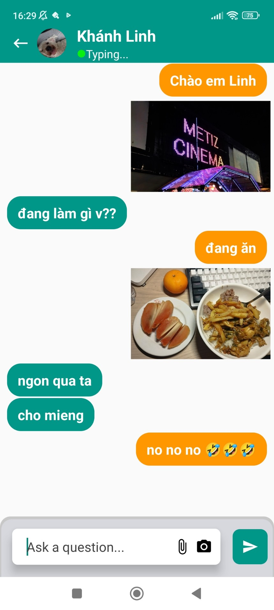</td>
    <td>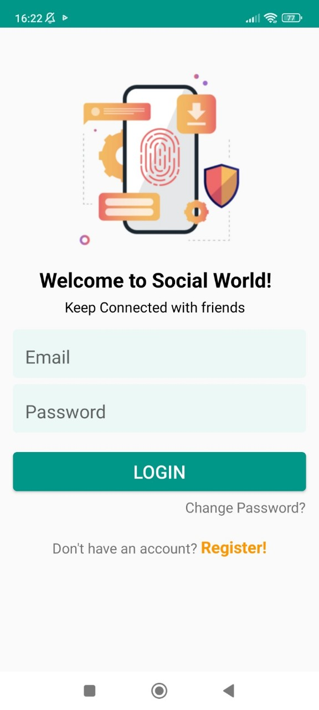</td>
    <td></td>
    <td></td>
  </tr>
  <tr>
    <td>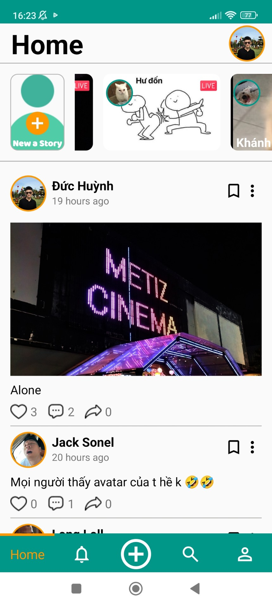</td>
    <td></td>
    <td></td>
    <td>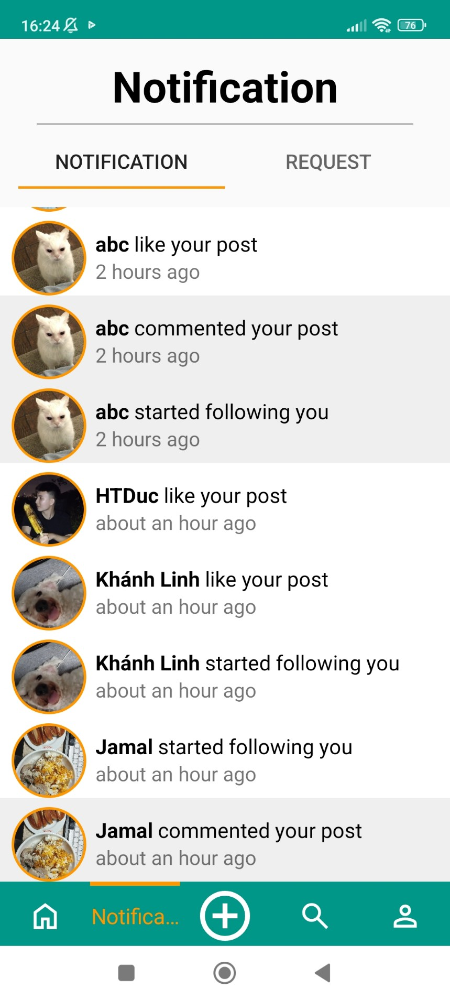</td>
  </tr>
  <tr>
    <td>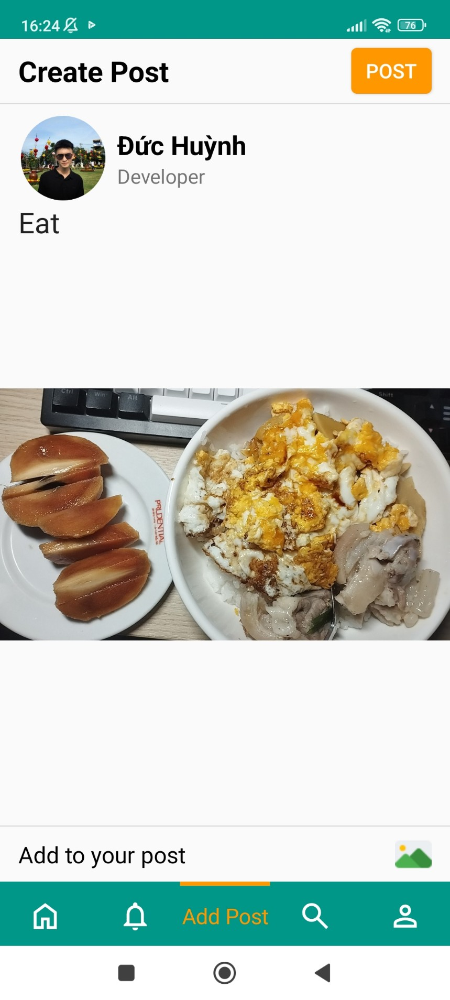</td>
    <td></td>
    <td></td>
    <td></td>
  </tr>
  <tr>
    <td></td>
    <td></td>
    <td></td>
    <td></td>
  </tr>
  <tr>
    <td></td>
    <td></td>
    <td>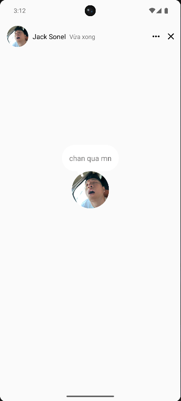</td>
    <td>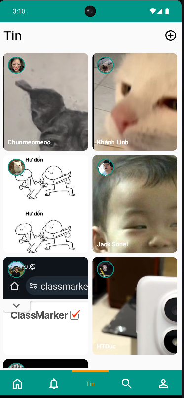</td>
  </tr>
  <tr>
    <td>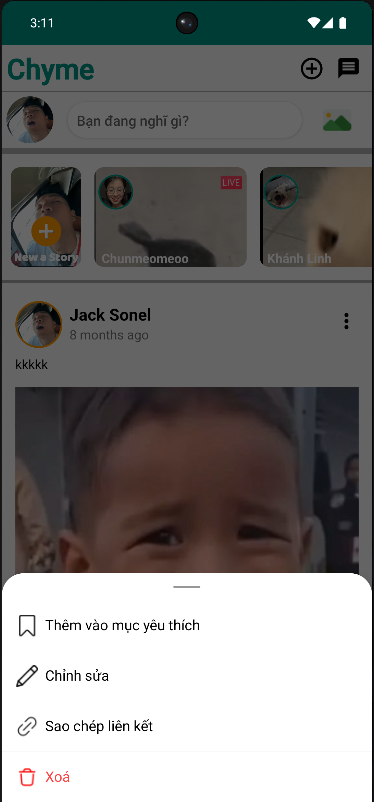</td>
    <td></td>
    <td>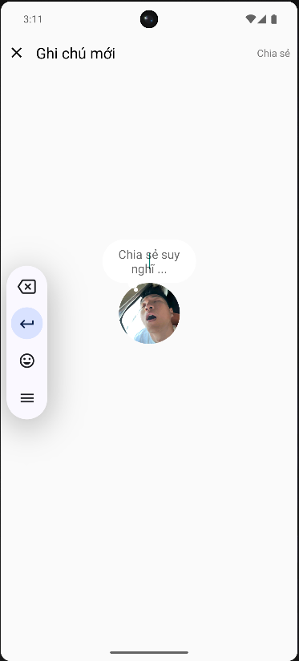</td>
    <td>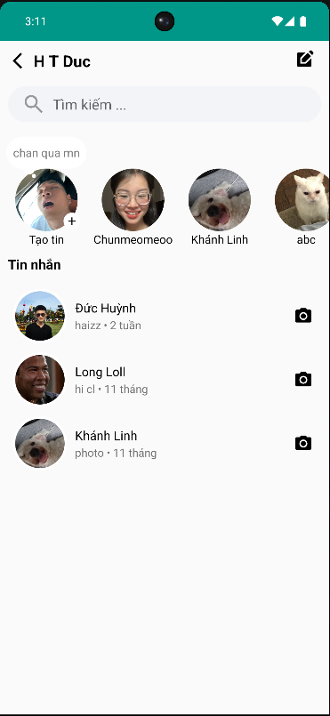</td>
  </tr>
  <tr>
    <td></td>
    <td>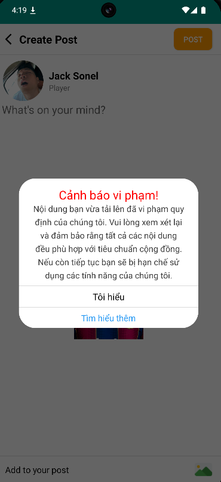</td>
    <td>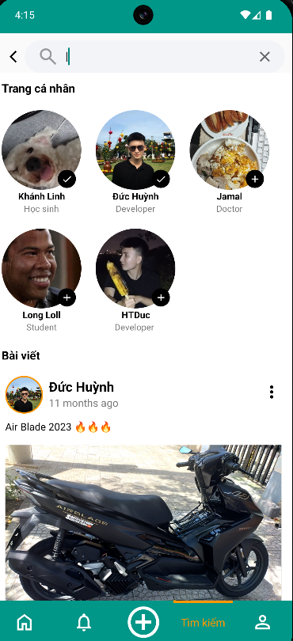</td>
  </tr>
</table>

  
# Libraries
- Dynamic size Library: https://github.com/MrNouri/DynamicSizes
- Circular Image View: https://github.com/hdodenhof/CircleImageView
- Rounded image View: https://github.com/vinc3m1/RoundedImageView
- Diagonal Layout in Android: https://github.com/florent37/DiagonalLayout
- CircularStatusView: https://github.com/3llomi/CircularStatusView
- StoryView: https://github.com/OMARIHAMZA/StoryView
- ShimmerRecyclerView: https://github.com/sharish/ShimmerRecyclerView
- TimeAgo: https://github.com/marlonlom/timeago
- Glide: https://github.com/bumptech/glide
- Picasso Library: https://github.com/square/picasso
- Firebase: https://firebase.google.com/

# Features
- User profile
- Follow
- Create Story
- Create Post
- Notification
- Like and Comment
- Messenger
- Personal features
- JobSchedukler
- Active state
- Note
- AI nfws and sentiment analysis
  
For Feedback or Suggestions Mail Me At huynhtrongduc01225445811@gmail.com 
