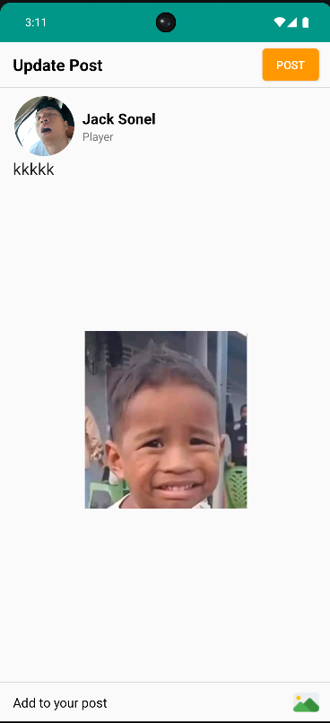

# 📱 SocialMediaApp

**SocialMediaApp** is a mobile social networking application that allows users to connect, share content, and communicate with each other. It comes with features like stories, posts, comments, messaging, and AI-based content moderation.
For Feedback or Suggestions Mail Me At huynhtrongduc01225445811@gmail.com 
---

## 🚀 Key Features

- 👤 User Profile
- ➕ Follow / Unfollow users
- 📸 Create & View Stories
- 📝 Create Posts with image or caption
- ❤️ Like & 💬 Comment on posts
- 💬 Real-time Chat / Messenger
- 🔔 Notification System
- 🧑 Personal Profile Management
- 📅 JobScheduler – Background Task Management
- 🟢 Online / Offline Active Status
- 🗒️ Personal Notes
- 🤖 AI Integration:
  - NSFW Content Detection
  - Sentiment Analysis for Comments

---

## 🖼️ Screenshots

> 👉 **[APK Download link – Coming Soon]**

<table style="width:100%">
  <tr>
    <td></td>
    <td></td>
    <td></td>
    <td></td>
  </tr>
  <tr>
    <td></td>
    <td></td>
    <td></td>
    <td></td>
  </tr>
  <tr>
    <td></td>
    <td></td>
    <td></td>
    <td></td>
  </tr>
  <tr>
    <td></td>
    <td></td>
    <td></td>
    <td></td>
  </tr>
  <tr>
    <td></td>
    <td></td>
    <td></td>
    <td></td>
  </tr>
  <tr>
    <td></td>
    <td></td>
    <td></td>
    <td></td>
  </tr>
  <tr>
    <td></td>
    <td></td>
    <td></td>
    <td></td>
  </tr>
</table>

---

## 🧩 Libraries Used

| Library | Purpose |
|--------|---------|
| [DynamicSizes](https://github.com/MrNouri/DynamicSizes) | Responsive UI sizing |
| [CircleImageView](https://github.com/hdodenhof/CircleImageView) | Circular avatar display |
| [RoundedImageView](https://github.com/vinc3m1/RoundedImageView) | Rounded image corners |
| [DiagonalLayout](https://github.com/florent37/DiagonalLayout) | Diagonal UI design |
| [CircularStatusView](https://github.com/3llomi/CircularStatusView) | Instagram-like story indicator |
| [StoryView](https://github.com/OMARIHAMZA/StoryView) | Full-screen story viewer |
| [ShimmerRecyclerView](https://github.com/sharish/ShimmerRecyclerView) | Loading shimmer effect |
| [TimeAgo](https://github.com/marlonlom/timeago) | Relative time formatting ("2 hours ago") |
| [Glide](https://github.com/bumptech/glide) / [Picasso](https://github.com/square/picasso) | Image loading |
| [Firebase](https://firebase.google.com/) | Auth, Realtime Database, Storage, Cloud Messaging |

---

## 🔧 Setup Instructions

### Prerequisites:
- Android Studio Flamingo or later
- JDK 11+
- Firebase project (with `google-services.json`)
- Android SDK (API level 33+ recommended)

### Steps:
```bash
git clone https://github.com/ducshntrong/SocialMediaApp.git
cd SocialMediaApp

